<div align="center">


<h1>Workload Landing Zone IaC</h1>

<p><strong>The Strategic Foundation for Enterprise Workload Infrastructure, Multi-Cloud Landing Zone Patterns, and Compliant Environment Provisioning using Infrastructure as Code</strong></p>

[]()
[]()
[]()

<br/>

> **"The infrastructure is the platform; the landing zone is the foundation."** 
> Workload Landing Zone (Workload-LZ) is an enterprise-grade platform designed to provide a secure, measurable, and highly automated foundation for global cloud workload deployment. It orchestrates the complex lifecycle of application environments—from modular networking and identity foundations to automated security baselines, compute orchestration, and unified observability integration. By providing a centralized command center with unified landing-zone-as-code modules, automated deployment pipelines, and immutable infrastructure logs, it enables organizations to eliminate environmental inconsistencies, ensure secure workload scaling, and drive rapid digital transformation across the entire enterprise ecosystem.

</div>

---

## 🏛️ Executive Summary

Fragmented cloud environments and manual infrastructure provisioning are strategic operational liabilities; lack of a standardized landing zone is a primary barrier to workload agility. Organizations fail to scale their cloud applications not because of a lack of features, but because of fragmented networking standards, lack of clear security baselines, and an inability to provision compliant environments with operational precision.

This platform provides the **Infrastructure Intelligence Plane**. It implements a complete **Enterprise Landing-Zone-as-Code Framework**—from modular Networking and Security components to specialized Compute and Database hubs. By operationalizing environment delivery as a primary architectural pillar, it ensures that your global workload stack is not just "deployed," but continuously optimized and delivered with strategic performance-aligned precision.

---

## 🏛️ Core Platform Pillars

1. **Modular Landing Zone Foundation**: High-performance, reusable Terraform modules for provisioning isolated environments (Dev, Staging, Prod).
2. **Hardened Networking Architecture**: Carrier-grade VPC/VNet patterns with multi-layer subnetting, private endpoints, and secure ingress/egress.
3. **Security & Governance Baseline**: Intelligent orchestration of IAM roles, encryption standards (KMS), and policy-as-code enforcement.
4. **Workload Compute Orchestration**: Automated provisioning of compute resources (VMs, Containers) with integrated security group isolation.
5. **Data & Storage Fabric**: Advanced modeling of storage accounts, database clusters, and automated backup strategies.
6. **Unified Observability Integration**: Deep integration with logging and metrics stacks for full-stack visibility into workload health.

---

## 📐 Architecture Storytelling: 50+ Advanced Diagrams

### 1. The Landing-Zone-as-Code Loop
*The flow from module definition to compliant workload operations.*
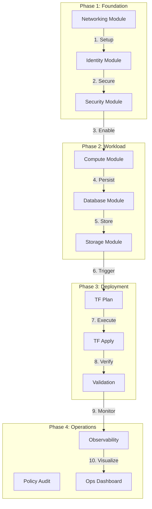

### 2. Multi-Environment Topology
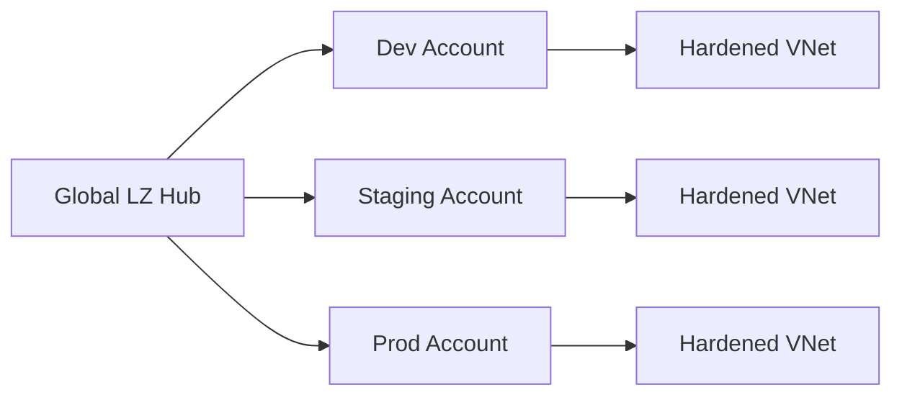

### 3. Hardened Networking Flow
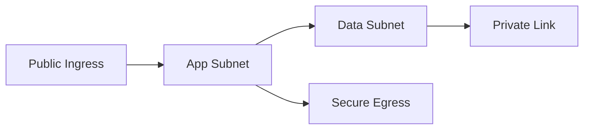

### 4. Workload LZ Architecture
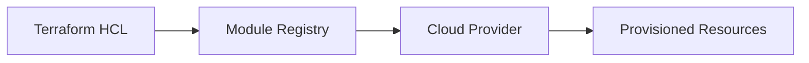

### 5. Deployment Topology: High-Availability Landing Hub
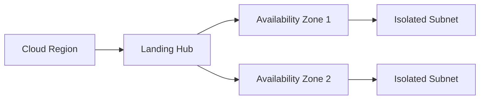

### 6. Policy-as-Code Enforcement Model
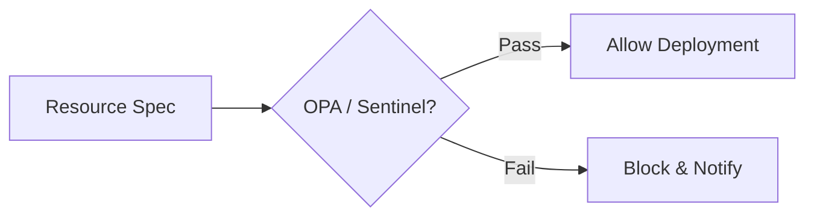

### 7. Foundation: Multi-Environment Setup
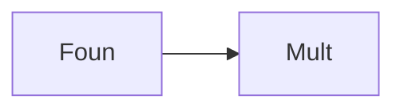

### 8. Networking: Hardened VNet Topology
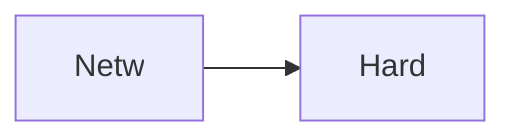

### 9. Component: Networking Module
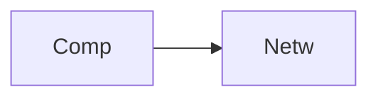

### 10. Component: Security Module
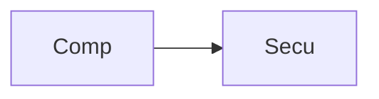

### 11. Component: Compute Module
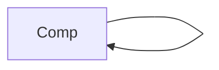

### 12. Component: Database Module
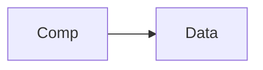

### 13. Logic: Naming Convention Engine
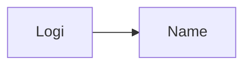

### 14. Logic: Tagging Enforcement
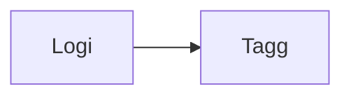

### 15. Logic: RBAC Least Privilege
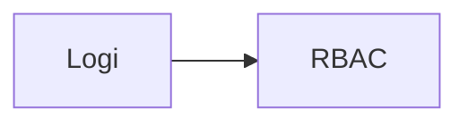

### 16. Logic: Environment Promotion
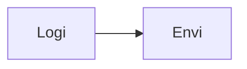

### 17. Architecture: Global Control Plane
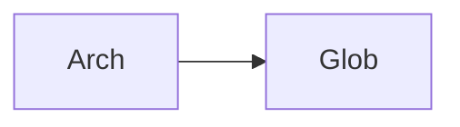

### 18. Architecture: Infrastructure Mesh
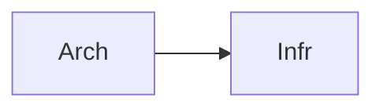

### 19. Architecture: Multi-Sink Logging
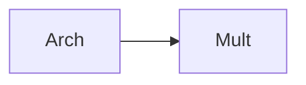

### 20. Pattern: Landing-Zone-as-Code
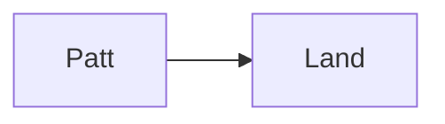

### 21. Pattern: Immutable Target Zones
```mermaid
graph LR
    P[Patt] --> I[Immu]
```

### 22. Pattern: Automated Remediation
```mermaid
graph LR
    P[Patt] --> A[Auto]
```

### 23. Security: Signed IaC Artifacts
```mermaid
graph LR
    S[Secu] --> S[Sign]
```

### 24. Security: RBAC Deployment Access
```mermaid
graph LR
    S[Secu] --> R[RBAC]
```

### 25. Security: Secure Audit Record
```mermaid
graph LR
    S[Secu] --> S[Secu]
```

### 26. Feature: LZ Health Heatmap UI
```mermaid
graph LR
    F[Feat] --> L[LZHe]
```

### 27. Feature: Real-time Velocity Tailing
```mermaid
graph LR
    F[Feat] --> R[Real]
```

### 28. Feature: Auto-generated PCAPs
```mermaid
graph LR
    F[Feat] --> A[Auto]
```

### 29. Compliance: NIST LZ Audits
```mermaid
graph LR
    C[Comp] --> N[NIST]
```

### 30. Compliance: Audit Trail Persistence
```mermaid
graph LR
    C[Comp] --> A[Audi]
```

### 31. Infrastructure: Redis State Cache
```mermaid
graph LR
    I[Infr] --> R[Redi]
```

### 32. Infrastructure: Postgres Fleet DB
```mermaid
graph LR
    I[Infr] --> P[Post]
```

### 33. Deployment: Kubernetes Hub Pods
```mermaid
graph LR
    D[Depl] --> K[Kube]
```

### 34. Deployment: Multi-Region Wave Sync
```mermaid
graph LR
    D[Depl] --> M[Mult]
```

### 35. Monitoring: deployment velocity KPI
```mermaid
graph LR
    M[Moni] --> D[Depl]
```

### 36. Monitoring: policy compliance KPI
```mermaid
graph LR
    M[Moni] --> P[Poli]
```

### 37. UI: Unified LZ Dashboard
```mermaid
graph LR
    U[UI] --> U[Unif]
```

### 38. UI: Network Hub UI
```mermaid
graph LR
    U[UI] --> N[Netw]
```

### 39. UI: ROI View
```mermaid
graph LR
    U[UI] --> R[ROIV]
```

### 40. UI: Readiness Heatmap
```mermaid
graph LR
    U[UI] --> R[Read]
```

### 41. CI/CD: Module validation pipeline
```mermaid
graph LR
    C[CICD] --> M[Modu]
```

### 42. CI/CD: LZ engine tests
```mermaid
graph LR
    C[CICD] --> L[LZEn]
```

### 43. Strategy: Modernization-First LZ
```mermaid
graph LR
    S[Stra] --> M[Mode]
```

### 44. Strategy: Data-Driven Environments
```mermaid
graph LR
    S[Stra] --> D[Data]
```

### 45. Feature: Multi-Cloud Search Bridge
```mermaid
graph LR
    F[Feat] --> M[Mult]
```

### 46. Feature: Real-time Outage Alerts
```mermaid
graph LR
    F[Feat] --> R[Real]
```

### 47. Feature: LZ Forecasting
```mermaid
graph LR
    F[Feat] --> L[LZFo]
```

### 48. Logic: Cost Comparison Engine
```mermaid
graph LR
    L[Logi] --> C[Cost]
```

### 49. Data Model: Environment Task Entity
```mermaid
graph LR
    D[Data] --> E[Envi]
```

### 50. Enterprise Landing Zone Excellence
```mermaid
graph LR
    E[Entr] --> E[Land]
```

---

## 🛠️ Technical Stack & Implementation

### Infrastructure-as-Code
- **Framework**: Terraform 1.0+.
- **Modules**: Reusable components for Networking, Identity, Security, Compute, and Storage.
- **Environments**: Isolated configuration for Dev, Staging, and Production tiers.
- **Provider**: AWS (Simulated patterns for Azure/GCP).
- **Patterns**: Private Endpoints, KMS Encryption-at-Rest, RBAC Least Privilege.

### CI/CD & Governance
- **Pipelines**: GitHub Actions for plan/apply workflows and linting.
- **Policies**: Integrated validation for naming conventions and tagging standards.
- **Validation**: Checkov / TFLint for security and best practice auditing.

---

## 🚀 Deployment Guide

### Local Development
```bash
# Clone the repository
git clone https://github.com/devopstrio/workload-landingzone-iac.git
cd workload-landingzone-iac

# Initialize the Landing Zone (Dev environment)
make init

# Plan the infrastructure deployment
make plan

# Apply the Landing Zone configuration
make apply

# Validate configuration compliance
make validate
```

---

## 📜 License
Distributed under the MIT License. See `LICENSE` for more information.
