<div align="center">


<h1>Workload Landing Zone IaC</h1>

<p><strong>The Strategic Foundation for Enterprise Workload Infrastructure, Multi-Cloud Landing Zone Patterns, and Compliant Environment Provisioning.</strong></p>

[]()
[]()
[]()

<br/>

> **"The infrastructure is the platform; the landing zone is the foundation."** 
> **Workload Landing Zone** is an enterprise-grade platform designed to provide a secure, measurable, and highly automated foundation for global cloud workload deployment. It orchestrates the complex lifecycle of application environments—from modular networking and identity foundations to automated security baselines and compute orchestration.

</div>

---

## 🏛️ Executive Summary

Fragmented cloud environments and manual infrastructure provisioning are strategic operational liabilities; lack of a standardized landing zone is a primary barrier to workload agility. Organizations fail to scale their cloud applications not because of a lack of features, but because of fragmented networking standards, lack of clear security baselines, and an inability to provision compliant environments with operational precision.

This platform provides the **Infrastructure Intelligence Plane**. It implements a complete **Enterprise Landing-Zone-as-Code Framework**, enabling Platform and Security teams to manage environment delivery as a first-class citizen. By automating the provisioning of isolated workload spokes and orchestrating real-time security guardrails, we ensure that every organizational asset—from Kubernetes clusters to SQL databases—is secure by default, audited for history, and strictly aligned with institutional cloud adoption frameworks.

---

## 📐 Architecture Storytelling: Principal Reference Models

### 1. Principal Architecture: Global Workload Landing Zone & Infrastructure Control Plane
This diagram illustrates the end-to-end flow from IaC triggering and modular provisioning to network isolation, security gating, and institutional infrastructure auditing.

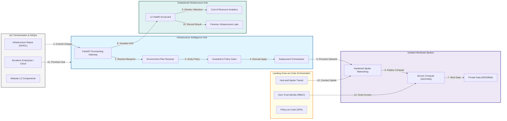

### 2. The Environment Lifecycle Flow
The continuous path of a cloud environment from initial planning and modular provisioning to hardening, active deployment, monitoring, and forensic auditing.

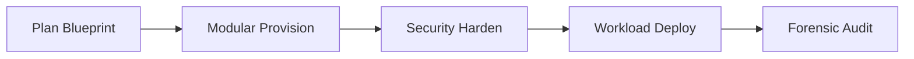

### 3. Hub-and-Spoke Network Topology
Strategic centralization of ingress/egress filtering in a "Hub" network, with peered "Spoke" networks providing total isolation for individual application workloads.

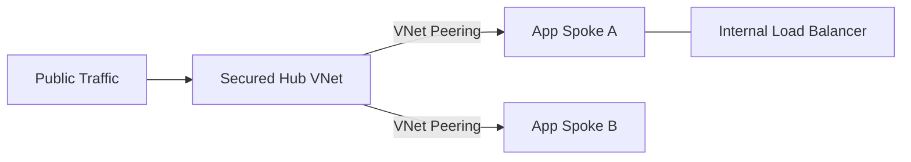

### 4. Zero-Trust Data Protection Mesh
End-to-end protection of platform services (Postgres, Blob, KeyVault) using Private Link, KMS encryption, and strictly enforced Network Security Groups.

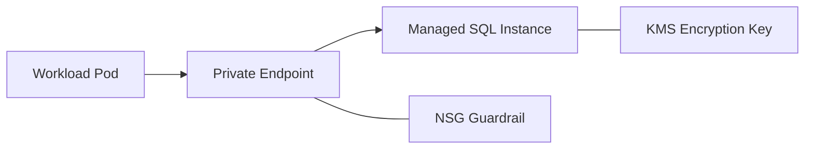

### 5. Multi-Stage Environment Promotion Flow
The institutional path for infrastructure changes, ensuring that landing zone blueprints are validated in sandbox and staging before reaching production.

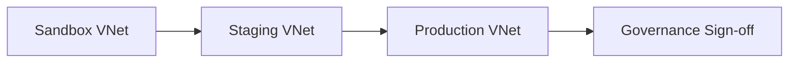

### 6. Identity & RBAC Hierarchy
Mapping organizational structures (Management Groups) to technical access boundaries (Subscriptions) to ensure least-privilege control across the environment.

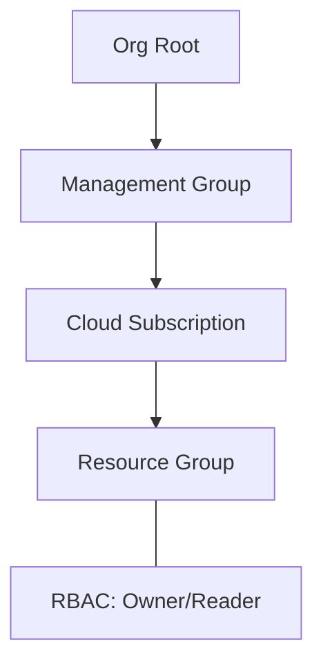

### 7. Security Guardrail Enforcement Hub
Automating the detection and remediation of non-compliant infrastructure using Policy-as-Code (Azure Policy/OPA) to prevent security drift.

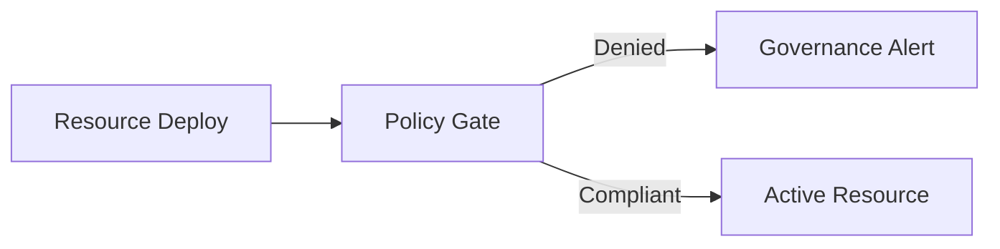

### 8. Institutional Landing Zone Scorecard
Grading organizational performance based on key indicators: Environment Provisioning Speed, Security Compliance, and Resource Utilization.

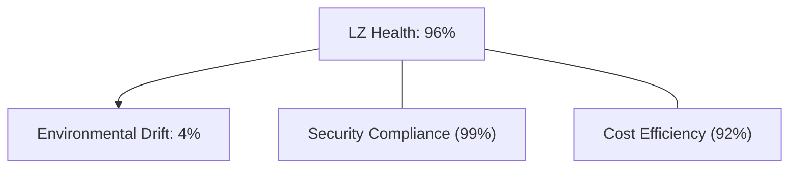

### 9. Identity & RBAC for LZ Governance
Managing fine-grained access to networking hubs, security policies, and workload spokes between Platform SREs, App Owners, and Security Leads.

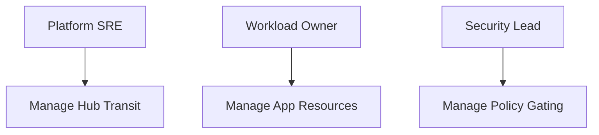

### 10. IaC Deployment: Infrastructure-as-Code Framework
Using modular Terraform to deploy and manage the versioned distribution of the landing zone hubs, networking spokes, and security baselines.

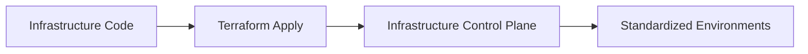

### 11. Metadata Lake for Forensic Infrastructure Audit
Storing long-term records of every Terraform plan, apply event, and security policy violation for institutional record-keeping and audit.

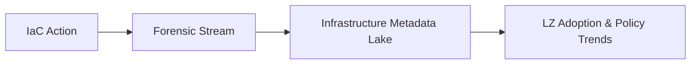

---

## 🏛️ Core Landing Zone Pillars

1.  **Modular Blueprint Foundation**: Provisioning isolated, standardized environments using reusable IaC modules.
2.  **Hub-and-Spoke Isolation**: Centralizing network security while ensuring total separation of workload traffic.
3.  **Zero-Trust Data Fabric**: Securing all PaaS services through Private Link and hardware-backed encryption.
4.  **Policy-as-Code Governance**: Enforcing institutional security and naming standards through automated gating.
5.  **Multi-Stage Promotion**: Ensuring infrastructure changes are validated across sandbox and staging environments.
6.  **Full Infrastructure Auditability**: Immutable recording of every environmental change for institutional forensics.

---

## 🛠️ Technical Stack & Implementation

### Infrastructure Engine & APIs
*   **Framework**: Terraform 1.0+ / Bicep.
*   **Provisioning Core**: Custom logic for orchestrating multi-region landing zone deployments and peering.
*   **Policy Engine**: OPA (Open Policy Agent) or Azure Policy for real-time compliance enforcement.
*   **State Management**: Secure Remote Backend (S3/Blob) with State Locking and versioning.
*   **Auth Orchestrator**: Federated OIDC/IAM for least-privilege infrastructure provisioning.

### Landing Zone Dashboard (UI)
*   **Framework**: React 18 / Vite.
*   **Theme**: Slate, Blue, Indigo (Modern operational aesthetic).
*   **Visualization**: Recharts for compliance scoring, environment health, and infrastructure cost trends.

### Infrastructure & DevOps
*   **Runtime**: AWS EKS or Azure Kubernetes Service (AKS).
*   **Networking**: Hub-and-Spoke transit architecture with centralized NVA/Firewall inspection.
*   **IaC**: Modular Terraform for deploying the infrastructure hub and workload spoke distributions.

---

## 🏗️ IaC Mapping (Module Structure)

| Module | Purpose | Real Services |
| :--- | :--- | :--- |
| **`infrastructure/lz_hub`** | Central management plane | EKS, PostgreSQL, Redis |
| **`infrastructure/networking`** | Transit & Spoke fabric | VNet/VPC, Peering, Firewall |
| **`infrastructure/compute`** | Secure execution tiers | AKS, EKS, VMSS |
| **`infrastructure/data`** | Private data services | RDS, Blob, SQL, Private Link |

---

## 🚀 Deployment Guide

### Local Principal Environment
```bash
# Clone the Landing Zone platform
git clone https://github.com/devopstrio/workload-landingzone-iac.git
cd workload-landingzone-iac

# Configure environment
cp .env.example .env

# Launch the LZ stack
make init

# Trigger a mock infrastructure plan and apply simulation
make simulate-provision
```

Access the Landing Zone Dashboard at `http://localhost:3000`.

---

## 📜 License
Distributed under the MIT License. See `LICENSE` for more information.

---
<div align="center">
  <p>© 2026 Devopstrio. All rights reserved.</p>
</div>
