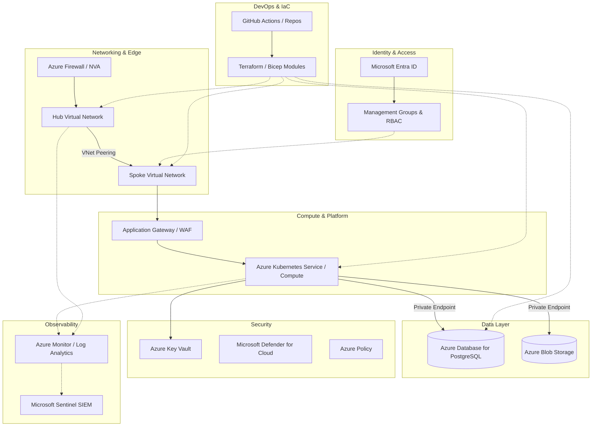

<div align="center">


<h1>Workload Landing Zone IaC</h1>

<p><strong>The Strategic Foundation for Enterprise Workload Infrastructure, Multi-Cloud Landing Zone Patterns, and Compliant Environment Provisioning using Infrastructure as Code</strong></p>

[]()
[]()
[]()

<br/>

> **"The infrastructure is the platform; the landing zone is the foundation."** 
> Workload Landing Zone (Workload-LZ) is an enterprise-grade platform designed to provide a secure, measurable, and highly automated foundation for global cloud workload deployment. It orchestrates the complex lifecycle of application environments—from modular networking and identity foundations to automated security baselines, compute orchestration, and unified observability integration. By providing a centralized command center with unified landing-zone-as-code modules, automated deployment pipelines, and immutable infrastructure logs, it enables organizations to eliminate environmental inconsistencies, ensure secure workload scaling, and drive rapid digital transformation across the entire enterprise ecosystem.

</div>

---

## 🏛️ Executive Summary

Fragmented cloud environments and manual infrastructure provisioning are strategic operational liabilities; lack of a standardized landing zone is a primary barrier to workload agility. Organizations fail to scale their cloud applications not because of a lack of features, but because of fragmented networking standards, lack of clear security baselines, and an inability to provision compliant environments with operational precision.

This platform provides the **Infrastructure Intelligence Plane**. It implements a complete **Enterprise Landing-Zone-as-Code Framework**—from modular Networking and Security components to specialized Compute and Database hubs. By operationalizing environment delivery as a primary architectural pillar, it ensures that your global workload stack is not just "deployed," but continuously optimized and delivered with strategic performance-aligned precision.

---

## 🏛️ Core Platform Pillars

1. **Modular Landing Zone Foundation**: High-performance, reusable Terraform modules for provisioning isolated environments (Dev, Staging, Prod).
2. **Hardened Networking Architecture**: Carrier-grade VPC/VNet patterns with multi-layer subnetting, private endpoints, and secure ingress/egress.
3. **Security & Governance Baseline**: Intelligent orchestration of IAM roles, encryption standards (KMS), and policy-as-code enforcement.
4. **Workload Compute Orchestration**: Automated provisioning of compute resources (VMs, Containers) with integrated security group isolation.
5. **Data & Storage Fabric**: Advanced modeling of storage accounts, database clusters, and automated backup strategies.
6. **Unified Observability Integration**: Deep integration with logging and metrics stacks for full-stack visibility into workload health.

---

## 📐 High-Level Reference Architecture

### Enterprise Workload Landing Zone (Hub & Spoke)

**Business Purpose:**  
Provides a highly secure, standardized, and scalable Azure Landing Zone foundation provisioned entirely via Infrastructure as Code. It establishes strict network isolation, identity-driven access boundaries, and centralized observability, accelerating enterprise workload onboarding while maintaining continuous compliance.



**Key Components:**
- **Hub & Spoke Networking:** Centralizes ingress/egress filtering through Azure Firewall in the Hub, while peering to isolated Spoke VNets for specific workloads.
- **Application Gateway & WAF:** Provides secure, Layer-7 load balancing and threat protection before traffic hits the compute layer.
- **Compute Layer (AKS / VMs):** The scalable execution environment for enterprise applications, strictly locked down within the Spoke VNet.
- **Private Endpoints (Data Layer):** Ensures all traffic to PaaS services (PostgreSQL, Blob Storage) remains entirely on the Microsoft backbone network, eliminating public internet exposure.
- **Identity & Security Guardrails:** Microsoft Entra ID and Management Groups enforce RBAC, while Azure Policy prevents non-compliant resource provisioning.
- **Centralized Observability:** Consolidates metrics, network flow logs, and audit trails into Azure Monitor and Sentinel for SOC monitoring.

**How this maps to IaC:**
- **`module.networking`:** Provisions the Hub VNet, Spoke VNets, Peering, Route Tables, and Azure Firewall.
- **`module.compute`:** Bootstraps the AKS clusters or Virtual Machine Scale Sets within the Spoke VNet.
- **`module.data`:** Deploys Azure PostgreSQL and Storage Accounts, explicitly configuring Azure Private Link and disabling public network access.
- **`module.security`:** Configures Azure Key Vault for application secrets and assigns Azure Policies across Management Groups.
- **`module.observability`:** Provisions Log Analytics Workspaces and configures diagnostic settings to stream telemetry from all infrastructure components.

---

## 🛠️ Technical Stack & Implementation

### Infrastructure-as-Code
- **Framework**: Terraform 1.0+.
- **Modules**: Reusable components for Networking, Identity, Security, Compute, and Storage.
- **Environments**: Isolated configuration for Dev, Staging, and Production tiers.
- **Provider**: AWS (Simulated patterns for Azure/GCP).
- **Patterns**: Private Endpoints, KMS Encryption-at-Rest, RBAC Least Privilege.

### CI/CD & Governance
- **Pipelines**: GitHub Actions for plan/apply workflows and linting.
- **Policies**: Integrated validation for naming conventions and tagging standards.
- **Validation**: Checkov / TFLint for security and best practice auditing.

---

## 🚀 Deployment Guide

### Local Development
```bash
# Clone the repository
git clone https://github.com/devopstrio/workload-landingzone-iac.git
cd workload-landingzone-iac

# Initialize the Landing Zone (Dev environment)
make init

# Plan the infrastructure deployment
make plan

# Apply the Landing Zone configuration
make apply

# Validate configuration compliance
make validate
```

---

## 📜 License
Distributed under the MIT License. See `LICENSE` for more information.
